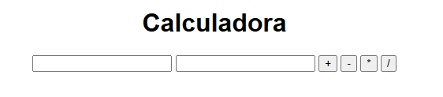

# proyecto-calculadora
Proyecto DPL - Calculadora sencilla

## Calculadora sencilla

## Descripción
Aplicación web sencilla que permite realizar operaciones básicas: suma, resta, multiplicación y división

## Tecnologías utilizadas
- HTML
- CSS
- JavaScript

## Instalación y ejecución
1. Clonar el repositorio
2. Abrir el archivo src/index.html en el navegador

## Capturas

